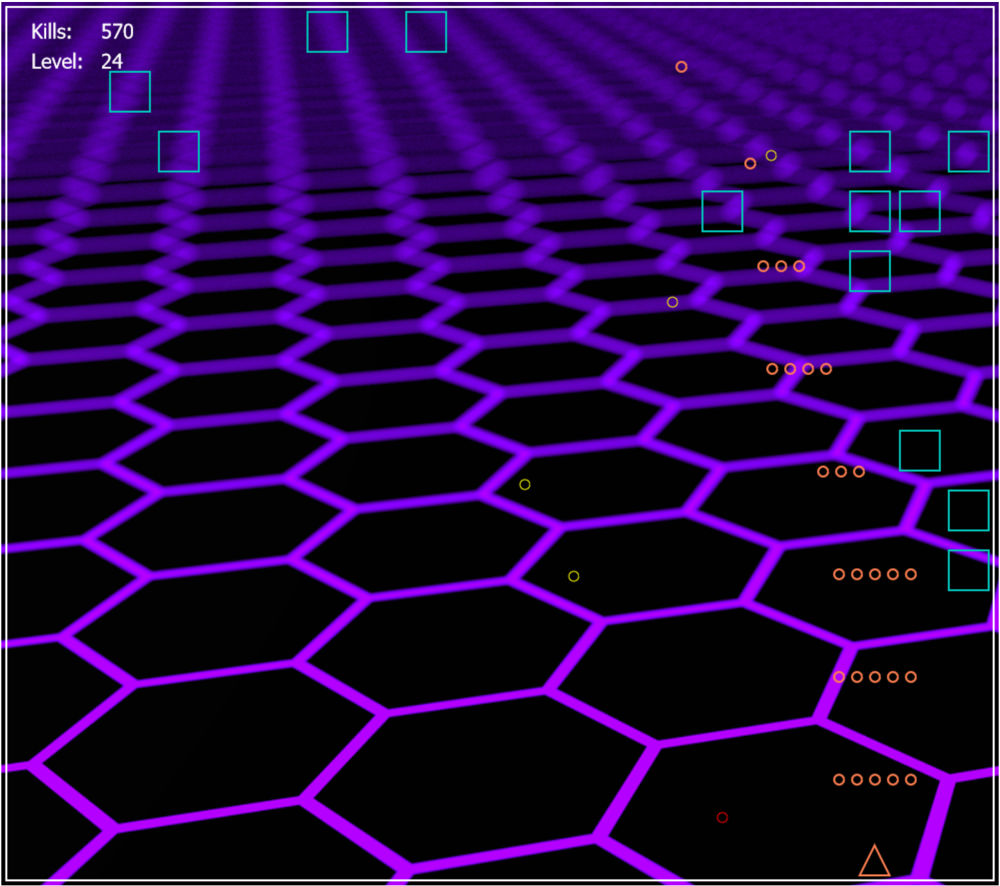

# Another Space Invaders Inspired Game

Simply another SpaceInvaders-inspired game!

*Play on <a href="https://andre96ac.itch.io/another-spaceinvaders-inspired-game">itch.io</a>*


<br>




<br>
<br>

Written in pure vanilla Typescript using canvas 2d api... 
- **NO Unity**
- **NO Libraries**
- **NO Useless tools**
- **NO Stupid stuff**

...Only old-fashioned code, <u>blood</u>, <u>sweat</u>, and <u>tears</u>

<br>
<br>


### Usage

#### Ready to play

run this to generate **dist** folder with ready-to-play game environment
```nodejs
    npm run build
```

then serve **dist** folder using a simple static web server (like vscode live-server extension)


<br>
<br>


#### Embedded in project

run this to generate a **dist-release** folder; use it to embedd the game in your project (no index.html and index.js will be generated)
```nodejs
npm run build-release
```

in your project, you can start the game this way:
```javaScript
import { SpaceInvaders } from "./dist-release/SpaceInvaders.js";


//HtmlDivElement
const mainContainer = document.getElementById("mainContainer");

const game = new SpaceInvaders(mainContainer);
game.start();


```


